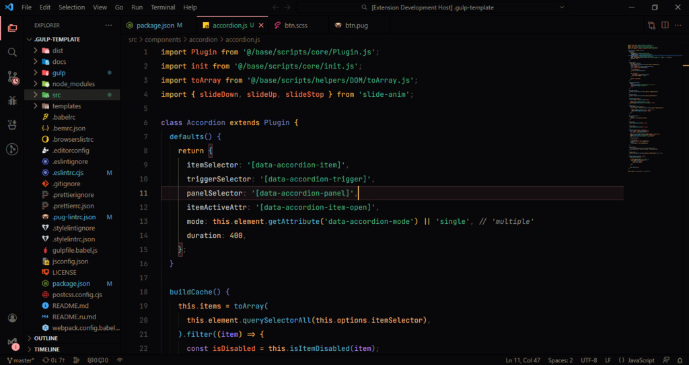

# Parfait Theme

## Screenshot

## 🚀 Installation

- Open the Extensions sidebar in VS Code.
- Search for `Parfait`.
- Click Install.
- Open the Command Palette with `Ctrl + Shift + P` or `⇧ + ⌘ + P`.
- Select Preferences: Color Theme and choose `Parfait Theme`.

## 📄 License

This theme is released under the MIT License.
